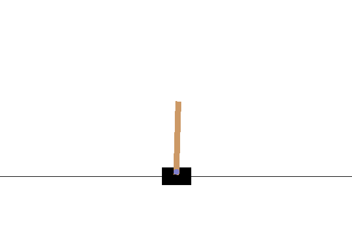

# REINFORCE & PPO PyTorch & Tensorflow implementations

This repository contains Torch & Tensorflow implementations of *_REINFORCE_* and *_Proximal Policy Optimization_* Deep Reinforcement Learning methods. Also provided in the repo is the `pong_karpathy.py` file courtesy of Andrej Karpathy from the famous 2016 blog-post [http://karpathy.github.io/2016/05/31/rl/]

### Test #1 TH

`reinforce_test1.py` uses `CartPole-v0` environment for basic REINFORCE. Included are grad calculation examples.
```
Number of steps until a solution is found:    
  Simple G calculation: 1353.0
  Normed disc rewards:   352.0
```


### Test #1 Keras

A secondary implementation is provided based on Tensorflow in `reinforce_test1_tf.py` with similar results. 
This particular implementation purpose is to demonstrate how to setup the training process for `REINFOCE` method with Tensorflow. Two methods are provided. 

```
Training with normed_disc_rewards=True
Episode 100     Average Score: 92.54    Average time/ep: 0.17s
Episode 200     Average Score: 155.79   Average time/ep: 0.27s
Episode 300     Average Score: 162.27   Average time/ep: 0.28s
Episode 400     Average Score: 174.52   Average time/ep: 0.30s
Environment solved in 422 episodes!     Average Score: 195.63
Agent init
Training with normed_disc_rewards=False
Episode 100     Average Score: 21.02    Average time/ep: 0.05s
Episode 200     Average Score: 46.70    Average time/ep: 0.08s
Episode 300     Average Score: 83.94    Average time/ep: 0.15s
Episode 400     Average Score: 181.34   Average time/ep: 0.32s
Episode 500     Average Score: 114.80   Average time/ep: 0.20s
Episode 600     Average Score: 44.91    Average time/ep: 0.08s
Episode 700     Average Score: 53.18    Average time/ep: 0.10s
Episode 800     Average Score: 80.72    Average time/ep: 0.15s
Episode 900     Average Score: 77.35    Average time/ep: 0.14s
Episode 1000    Average Score: 181.07   Average time/ep: 0.32s
Environment solved in 1024 episodes!    Average Score: 195.06
```



### Test #2

`reinforce_test2.py` uses either vanilla *REINFORCE* or *PPO PG* to solve `'PongDeterministic-v4'` env. Below are the comparision results for both methods:

#### PPO

For the *PPO PG* the policy manages to win some (almost constantly) at episode 350
```
Episode: 350, score:    1.2
  Workers: [-1.  1.  1.  1.  1.  3.  3.  1.]
  
Episode: 355, score:    0.5
  Workers: [ 3.  3. -3.  0.  0.  0. -2.  3.]
  
Episode: 360, score:    1.5
  Workers: [ 3.  3.  3.  1. -2. -2.  3.  3.]
  
Episode: 365, score:    0.1
  Workers: [ 0. -1.  0.  3.  0. -2.  1.  0.]
  
Episode: 370, score:    2.5
  Workers: [5. 1. 3. 3. 1. 3. 1. 3.]
```

and finally around episode  the results are showing good and consistent policy

```
Episode: 500, score:    4.8
  Workers: [3. 5. 5. 5. 5. 5. 5. 5.]
  
Episode: 505, score:    5.0
  Workers: [5. 5. 5. 5. 5. 5. 5. 5.]
  
Episode: 510, score:    5.0
  Workers: [5. 5. 5. 5. 5. 5. 5. 5.]
```


And here is the agent winning the game:


#### REINFORCE

in contrast the vanilla *REINFORCE* version does not perform well even after 800 episodes


```
Episode: 785, score:   -8.2,  time:  1.5 min / 82.0 min
  Workers: [ -3. -12.  -7.  -8. -11.  -9.  -6. -10.]
  
Episode: 790, score:   -6.4,  time:  1.0 min / 81.9 min
  Workers: [ -8.  -5. -10.  -3.  -7.  -7.  -5.  -6.]
  
Episode: 795, score:   -5.9,  time:  0.5 min / 81.9 min
  Workers: [-3. -1. -5. -8. -6. -6. -9. -9.]
  
Episode: 800, score:   -5.5,  time:  0.0 min / 81.9 min
  Workers: [ -2.  -3.  -8. -10.  -1. -10.  -9.  -1.]
```
And here is the test play (REINFORCE agent obviously losing the game):


